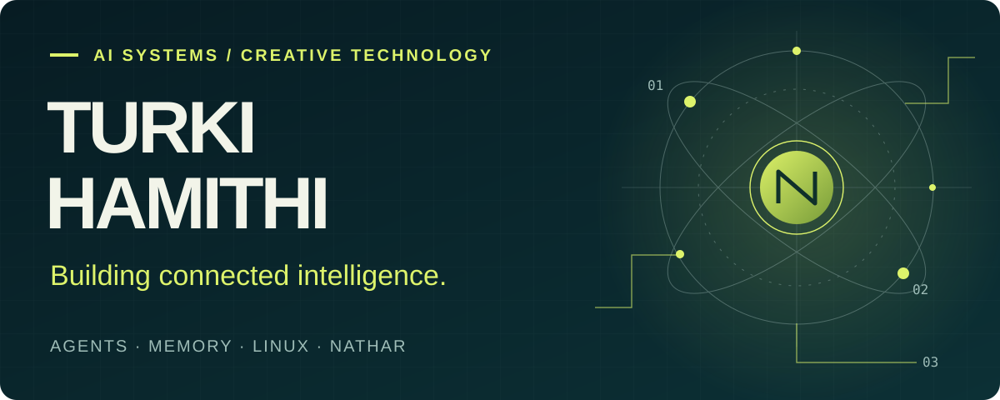
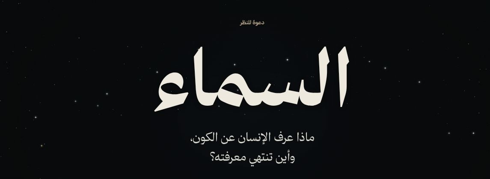
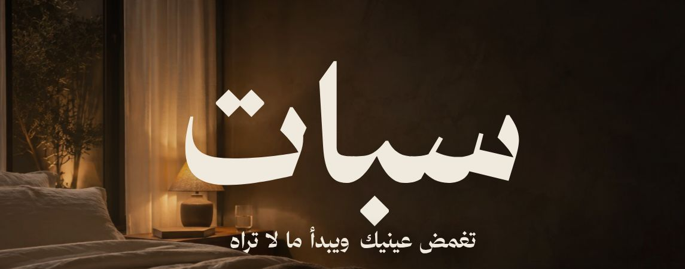
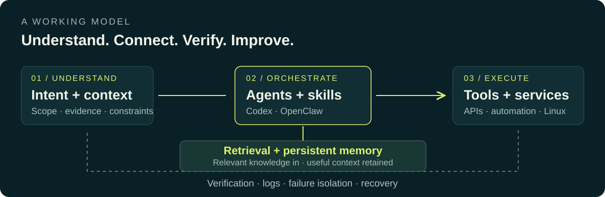

<picture>
  <source media="(max-width: 600px)" srcset="assets/hero-mobile.svg" />
  
</picture>

  <a href="https://natahr.com/"><strong>NATHAR →</strong></a>&nbsp; · &nbsp;
  <a href="#selected-work">Selected work</a>&nbsp; · &nbsp;
  <a href="#how-i-build">How I build</a>&nbsp; · &nbsp;
  <a href="#whats-next">What's next</a>&nbsp; · &nbsp;
  <a href="#بالعربية">العربية</a>

### I build the experience and the system behind it.

I'm **Turki Hamithi**, an AI Systems & Automation Specialist building **[NATHAR | نَظَر](https://natahr.com/)**. My work connects AI agents, persistent memory and self-managed infrastructure, and turns research into interactive web experiences.

**My technical workbench**

- **Agents & development** · Advanced Codex and OpenClaw workflows, modular skills, tool integration and multi-step automation
- **Knowledge & memory** · RAG, semantic retrieval, Qdrant and persistent context
- **Infrastructure & integration** · Linux, Docker, Nginx, Redis, MySQL, REST APIs, webhooks and Telegram bots
- **Interactive web** · HTML, CSS, JavaScript, Canvas and scroll-driven storytelling

## Selected work

Three live NATHAR experiences, built around research, interaction and a distinct visual world. Each image opens the project.

### [01 · Samaa / السماء →](https://natahr.com/samaa/)
**Astronomy as an interactive journey.** Twelve chapters exploring the universe and the limits of knowledge, with orbit and cosmic-expansion controls, linked sources and a motion toggle.

HTML · CSS · JavaScript · Canvas starfield · Interactive models

 

### [02 · Subat / سبات →](https://natahr.com/subat/)
**Making invisible processes explorable.** A twelve-chapter journey through sleep, dreams and memory, with adjustable signal displays, sleep-stage and caffeine controls, and 33 cited sources.

HTML · CSS · JavaScript · Canvas · Interactive scientific storytelling

 

### [03 · UNSINKABLE / سفينة لا تغرق →](https://natahr.com/unsinkable/)
**History you navigate. Engineering you can question.** A twelve-chapter Titanic experience combining cinematic scrollytelling with an interactive flooding threshold, optional sound and motion controls.

HTML · CSS · JavaScript · GSAP · ScrollTrigger · Interactive simulation

 

**More from NATHAR:** [Markets](https://natahr.com/markets/) · [Outlook](https://natahr.com/outlook/) · [OFOQ model guide](https://natahr.com/Astra/)

## How I build

<picture>
  <source media="(max-width: 600px)" srcset="assets/system-map-mobile.svg" />
  
</picture>

*A conceptual model of how I approach systems.*

1. **Start with evidence.** Question assumptions, return to first principles and make the sources inspectable.
2. **Keep the pieces modular.** Separate agent orchestration, memory and supporting services so each can evolve without entangling the rest.
3. **Test before rollout.** Isolate changes, trace failures through logs and turn bugs into reproducible reports.
4. **Treat boundaries as part of the design.** Keep credentials and private infrastructure out of public artifacts. Prefer verified fixes and maintainable recovery paths over chains of workarounds.

## What's next

I plan to share more of the useful work behind these systems: **scripts, tools and practical technical notes** for people building with AI agents and Linux.

Planned directions: reusable automation, agent skills, memory/retrieval patterns and reproducible debugging examples. These are future releases; the live projects above are available now.

<strong>Background that shapes the work</strong>

 

My independent AI systems work includes **200+ modular agent skills**. My operations background includes Hajj platforms, control rooms, technical support and supervision across **52 service centres** in the Nusuk project.

- **2022–present** · Independent AI Systems & Automation Specialist
- **2023–2026** · Systems, platforms and Hajj operations
- **2025** · Operations & Control Room Manager, Al-Qaid Transport
- **2022–2023** · Administrative Organization Specialist, King Abdulaziz Hospital
- **2021** · Technical Support Team Lead, Mobily

**Bachelor of Islamic Financial Economics (Finance)** · Umm Al-Qura University, 2021

## بالعربية

أنا **تركي**. أبني **[نَظَر | NATHAR](https://natahr.com/)**، وأعمل على أنظمة الوكلاء والأتمتة والذاكرة المستمرة والبنية التقنية على لينكس، باستخدام Codex وOpenClaw وأدوات الاسترجاع والتكامل.

تجمع أعمالي بين العمق التقني والتجربة البصرية: من **السماء** و**سبات** إلى **سفينة لا تغرق**. أبدأ من فهم المشكلة والتحقق من مصادرها، وأهتم بعزل التغييرات واختبارها، وتشخيص الأعطال، وبناء حلول قابلة للصيانة. والخطوة القادمة هي مشاركة سكريبتات وأدوات وشروحات عملية ليستفيد منها الآخرون.

<a href="https://natahr.com/"><strong>Explore NATHAR →</strong></a>

