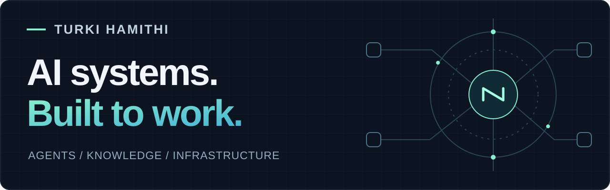

  

# TURKI HAMITHI

**AI Systems & Automation Specialist · Building [NATHAR](https://natahr.com/)**

I build AI agents and the systems around them: orchestration, knowledge retrieval, persistent memory, integrations and self-managed infrastructure. My work spans the agent layer and the services that keep it running.

  <a href="https://natahr.com/"><strong>Explore NATHAR ↗</strong></a>&nbsp;&nbsp; · &nbsp;&nbsp;
  <a href="#systems-i-build">Systems</a>&nbsp;&nbsp; · &nbsp;&nbsp;
  <a href="#operations-experience">Experience</a>&nbsp;&nbsp; · &nbsp;&nbsp;
  <a href="#بالعربية">العربية</a>

<table>
<tr>
<td width="50%" valign="top">
<h3>200+ modular skills</h3>
Designed and deployed for AI agents in my independent systems work.
</td>
<td width="50%" valign="top">
<h3>52 service centres</h3>
Operations supervised across the Nusuk project, alongside technical and field coordination.
</td>
</tr>
</table>

## Building NATHAR

I build **NATHAR | نَظَر**, bringing together AI, research, knowledge and digital experiences. My focus is on connecting useful capabilities into complete workflows, from retrieving information to coordinating tools and automating tasks.

**[Visit natahr.com →](https://natahr.com/)**

## Systems I build

| Area | Implementation focus |
| :--- | :--- |
| **Agents & orchestration** | Modular skills, tool integration and automated multi-step workflows |
| **Retrieval & memory** | RAG, semantic search, vector retrieval, Qdrant and persistent memory |
| **APIs & automation** | REST APIs, webhooks, Telegram Bot API and scheduled jobs |
| **Self-managed platforms** | Linux, Docker, Nginx, Redis and MySQL, with monitoring and backup automation |

## Operations experience

My systems work is backed by experience in **Hajj operations (2023–2026)**, control rooms, technical support and service coordination. That includes supervising operations across **52 service centres** in the Nusuk project, resolving technical issues and connecting technical teams with field operations.

<strong>Professional background & education</strong>

 

| Period | Selected experience |
| :--- | :--- |
| **2022–present** | Independent AI Systems & Automation Specialist |
| **2023–2026** | Systems, platforms and Hajj operations |
| **2025** | Operations & Control Room Manager · Al-Qaid Transport |
| **2022–2023** | Administrative Organization Specialist · King Abdulaziz Hospital |
| **2021** | Technical Support Team Lead · Mobily |

**Bachelor of Islamic Financial Economics (Finance)** · Umm Al-Qura University, 2021

My background also includes independent financial-market analysis: harmonic patterns, Fibonacci ratios, potential reversal zones and risk management using TradingView.

## بالعربية

أنا تركي، متخصص في أنظمة الذكاء الاصطناعي والأتمتة. أبني **NATHAR | نَظَر**، وأربط الوكلاء بالأدوات والمعرفة والذاكرة المستمرة، مع تشغيل البنية التقنية ذاتيًا. تجمع خبرتي بين بناء الأنظمة وعمليات الحج وغرف التحكم والإشراف على العمليات عبر **52 مركز خدمة** ضمن مشروع نسك.

